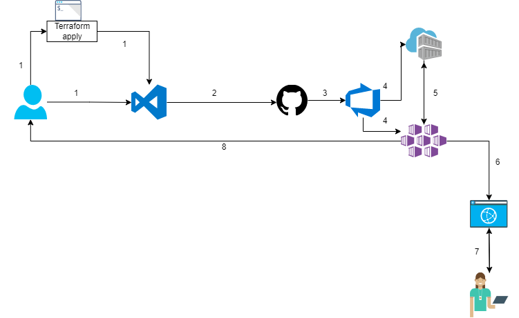

# azdevops-aks-project

##### complete lifecycle of a azure Pipeline-project
[](https://dev.azure.com/bchabbi/Space%20Game%20-%20web%20-%20Pipeline/_build/latest?definitionId=22&branchName=main)

## Architecture




## Requirements

To work on this project, you will need the following:

- An active Azure subscription to create the required resources for this project.
- Azure KeyVault to safely store all secrets regarding the project.
- An Azure DevOps organization to store the project code, track work items, and automate the CI/CD pipelines.
- An AKS cluster to deploy the application. This will be deployed with Terraform.
- Docker installed on your local machine to build and push Docker images to the Azure Container Registry (ACR).
- Kubernetes-service-connection, Docker-registry-service connection, and subscription-service-connection set up in Azure DevOps.
- A service principal to create or add. You can do this by running the command az ad sp create-for-rbac --scopes /subscriptions/mySubscriptionID.
- Helm installed on your local machine to package, install, and manage Kubernetes applications.
- kubectl installed on your local machine to manage Kubernetes clusters.
- Azure CLI installed on your local machine to create and manage Azure resources.
- Git installed on your local machine to clone and work with the project code.
- Visual Studio Code (or any other code editor of your choice) installed on your local machine to work with the project code.

## Installation 
1. Clone or fork the repo.
   ```bash 
   git clone https://github.com/0xchabbi/azdevops-aks-project.git
   ```
2. Set up your Azure Devops and add this repo to your project.
3. Add the right Serviceconnection in you AzureDevops project. This contains a serviceconnection to your Azure account, a dockerregistry serviceconnection and a kubernetes serviceconnection(this connection is possible after you set up with Terraform because you need your kubeconfig file)
4. In your Terminal go to the Terraform-Folder
   ```bash
    #login to your azure account
    az login
    #initialize your Terraform-backend
    terraform init
    #see what will be deployed
    terraform plan
    #deploy the terraform modul to azure
    terraform apply
    ```
5. Start the Pipeline in your AzureDevops project or trigger the pipeline with a push to your forked repo
6. Destroy your work with:
   ```bash
   terraform destroy
   ```

## Troubleshooting

While setting up and deploying this project, you may encounter some common issues. Here are some tips to help you troubleshoot these issues:

Azure DevOps Service connection errors: If you encounter issues with the Azure DevOps Service connection, ensure that you have the correct credentials and that you've followed the steps to create the service connection correctly.

Azure KeyVault errors: If you encounter issues with retrieving secrets from the Azure KeyVault, ensure that you have the correct permissions and that the secrets are stored correctly in the KeyVault.

Docker image build errors: If you encounter issues with building the Docker image, ensure that Docker is installed correctly and that you have the correct Dockerfile configuration.

AKS cluster deployment errors: If you encounter issues with deploying the application to the AKS cluster, ensure that you have the correct permissions and that the cluster is set up correctly with the required resources.

HA-Proxy ingress errors: If you encounter issues with the HA-Proxy ingress, ensure that the ingress is installed correctly using Helm and that you've configured the ingress correctly to expose the application to external users.

Test errors: If you encounter issues with the application not running correctly or the test failing, check that the deployment and configuration are correct, and that the application is functioning as expected.

If you encounter issues that you're unable to resolve, you can refer to the Azure documentation or seek assistance from the Azure support team.

## Reference and Links

- The PDF-Documentation
- Azure Subscription: 
  https://docs.microsoft.com/en-us/azure/cost-management-billing/manage/create-subscription
- Azure Key Vault:
  https://docs.microsoft.com/en-us/azure/key-vault/general/basic-concepts
- Azure DevOps:
  https://docs.microsoft.com/en-us/azure/devops/user-guide/what-is-azure-devops?view=azure-devops
- Azure Kubernetes Service (AKS):
  https://docs.microsoft.com/en-us/azure/aks/intro-kubernetes
- Docker:
  https://docs.docker.com/
- Azure DevOps Service connections:
  https://docs.microsoft.com/en-us/azure/devops/pipelines/library/service-endpoints?view=azure-devops&tabs=yaml
- Azure Service Principal:
  https://docs.microsoft.com/en-us/azure/active-directory/develop/howto-create-service-principal-portal
- Helm:
  https://helm.sh/docs/
- kubectl:
  https://kubernetes.io/docs/reference/kubectl/kubectl/
- Azure CLI:
  https://docs.microsoft.com/en-us/cli/azure/
- Git:
  https://git-scm.com/
- Visual Studio Code:
  https://code.visualstudio.com/